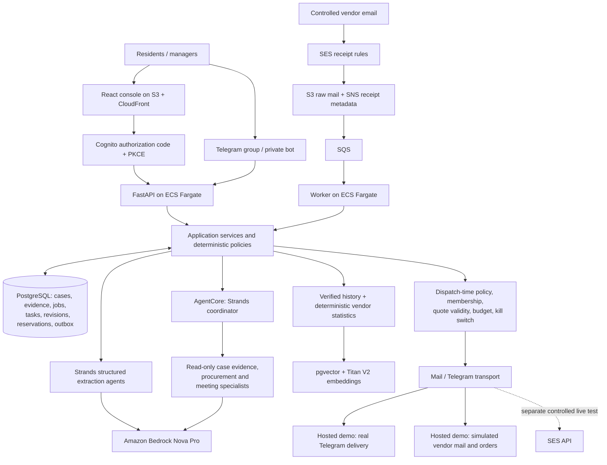

# Steward architecture

Northgate is a single synthetic community. Residents report issues and respond to
their own invitations/questions. Management sees operations, source evidence,
exceptions and decisions. The deterministic application owns authority and state.

## Execution and trust boundaries

1. A verified channel or authenticated web command durably records the input and
   its continuation. Idempotency keys and expected case versions reject stale writes.
2. The worker leases due jobs. Model and provider calls occur outside database
   transactions. Fencing prevents an expired owner from committing another worker's result.
3. Strands performs classification, extraction and source-bound planning. The
   AgentCore coordinator can call procurement/meeting specialists as tools. Returned
   proposals include evidence IDs; service code enforces spending and transitions.
4. A commitment reserves available budget atomically. Dispatch rechecks current
   authority and evidence. An ambiguous service-order send is held for reconciliation.
5. A delivered order awaits a vendor-backed appointment. Completion requires an
   authorized resident/manager response; rejected work enters rework/warranty follow-up.
6. Only verified outcomes enter community memory. Meeting minutes also require
   authorized confirmation before becoming decisions and owned action items.

Telegram account linking uses expiring one-use tokens and provider membership checks.
Private cards are sent only to linked recipients. Mail requires sender verdicts,
registered vendor, case reply context and delivered RFQ evidence. SES receipt intake
is acknowledged only after raw evidence plus continuation/review is durable.

## Deployment versus local replay

The deployed stack uses CloudFront/S3, Cognito, two Fargate tasks, private encrypted
RDS, Secrets Manager, CloudWatch and AgentCore. SQLite implements the same store
contract for local/offline tests. CloudFront's origin reaches the private API load
balancer; the database is not a public endpoint.

Simulation supplies external events and workflow time through authenticated API
endpoints. It does not edit case status directly. Offline acceptance replaces model
ports with deterministic fixtures; the hosted product calls real Bedrock. Hosted vendor
mail and order receipts are simulated and labeled. Telegram ingress and outgoing
notifications are live; see [TELEGRAM_DELIVERY_REVIEW](TELEGRAM_DELIVERY_REVIEW.md).
The real controlled SES roundtrip has separate evidence in
[CONTROLLED_MAIL_TEST](CONTROLLED_MAIL_TEST.md).

The active SES receipt rule set is shared with another project. Steward adds only
its own recipient routes; replacing the active set would interrupt that project.
See [operations](OPERATIONS.md) for migrations, restore limitations and live-mode gates.
